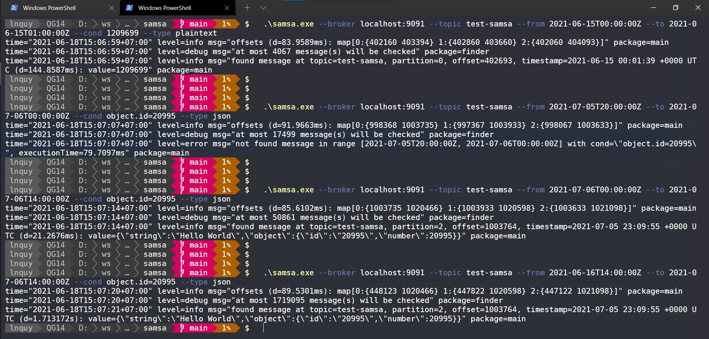

# samsa
Search message in Kafka topic.  
```shell
$ samsa --broker localhost:9091 --topic test-samsa --from 2021-06-16T14:00:00Z --to 2021-07-06T14:00:00Z --cond object.id=20995 --type json
```

### Prerequisites

1. Go >1.13
2. Docker + docker-compose

### How to?

1. Clone code to local

   ```shell
   $ git clone https://github.com/lnquy/samsa
   $ cd samsa
   ```

2. Start a Kafka cluster in Docker:

   ```shell
   $ cd deployment
   $ docker-compose up
   ```

3. Open `http://localhost:9000`  and create your test topic, let's call it `test-samsa` with `partition=3` and `replicationFactor=1`

4. Edit the `cmd/samsa/main.go` file to run the `writeTestData` function only.  
   You can use that function to publish messages (3,000,000 plaintext and 100,000 JSON messages) into the created Kafka topic above.  
   After finished running, check on the `http://localhost:9000` and you should see `test-samsa` topic has 3 partitions with each has ~1,030,000 messages.

   ```shell
   # Example: Make sure you already edited the cmd/samsa/main.go to run the writeTestData function
   $ cd cmd/samsa
   $ go build
   $ ./samsa --broker localhost:9091 --topic test-samsa
   ```

5. Remove the `writeTestData` function from `cmd/samsa/main.go` and we're ready to test searching message in Kafka topic now.

   ```shell
   $ go build
   
   # Plaintext exact match on message value/data.
   $ ./samsa --broker localhost:9091 --topic test-samsa --from 2021-06-15T00:00:00Z --to 2021-06-15T01:00:00Z --cond 1209699 --type plaintext
   
   # JSON not found in search range.
   $ ./samsa --broker localhost:9091 --topic test-samsa --from 2021-07-05T20:00:00Z --to 2021-07-06T00:00:00Z --cond object.id=20995 --type json
   
   # JSON found.
   $ ./samsa --broker localhost:9091 --topic test-samsa --from 2021-07-06T00:00:00Z --to 2021-07-06T14:00:00Z --cond object.id=20995 --type json
   
   # JSON found with bigger time range (~1,700,000 messages need to be checked).
   $ ./samsa --broker localhost:9091 --topic test-samsa --from 2021-06-16T14:00:00Z --to 2021-07-06T14:00:00Z --cond object.id=20995 --type json
   ```



